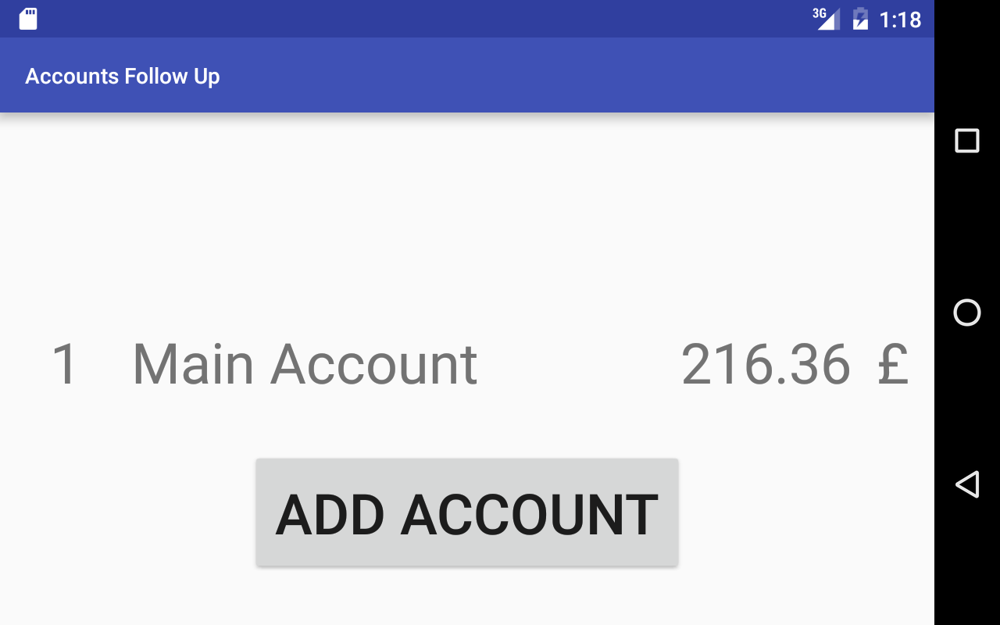
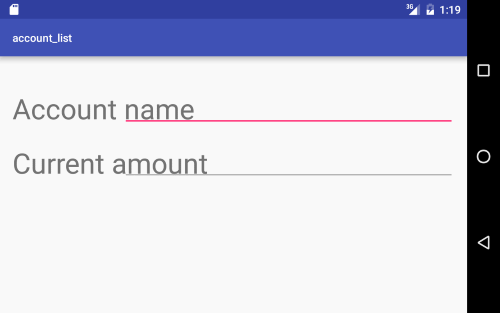

# Accounts Follow Up

## About

This is a simple app project that allows to keep tracks of your bank accounts.
I'm doing it because online bank sites takes forever to show the transactions,
so I began to note every transactions I made on a paper, but I always lost it.
So then I decided to build an app for this.
It is not automated though, you'll have to enter each transactions by hand.
It is not builded in order to replace any bank app or whatever.

## Progression

- 03/27/2017 : 
    * Creation of the project
    * Database creation
- 03/28/2017 :
    * Database insertion, update and select
    * Add listview of all accounts
    * Possibility to add an account
    * Possility to view an account details by clicking on it
    
## Screenshots
(will change in time)
  
   Main view
  
   Accoun Creation view